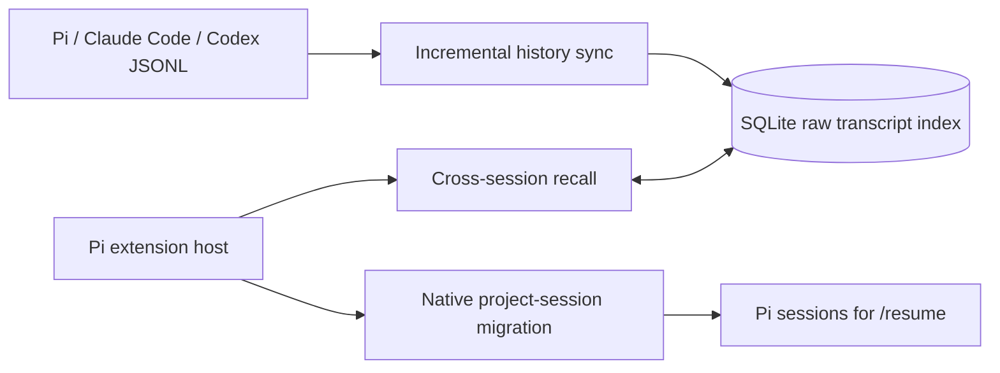
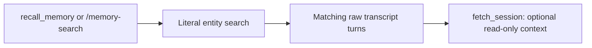

# pi-session-memory feature map

> **Implementation baseline:** package version `0.6.0` (raw transcript index and native migration only).

## Architecture

## Recall flow

## Feature inventory

| Area | Entry points | Behavior |
| --- | --- | --- |
| Incremental history sync | `session_start` | Imports new or changed Pi, Claude Code, and Codex transcript history. |
| Live Pi turn persistence | `agent_settled` | Writes the completed current Pi turn to SQLite. |
| Cross-session recall | `recall_memory`, `/memory-search` | Searches and returns every matching raw transcript turn. |
| Session expansion | `fetch_session` | Retrieves a requested stored turn range as read-only evidence. |
| Native migration | Migration commands and tools | Converts current-project Claude Code or Codex sessions into native Pi sessions for `/resume`. |
| Storage visibility and import | `get_memory_stats`, `backfill_memory` | Shows raw-index totals and explicitly imports historical transcript data. |

The SQLite database contains `sessions`, `turns`, and `source_files` for local transcript retrieval.
